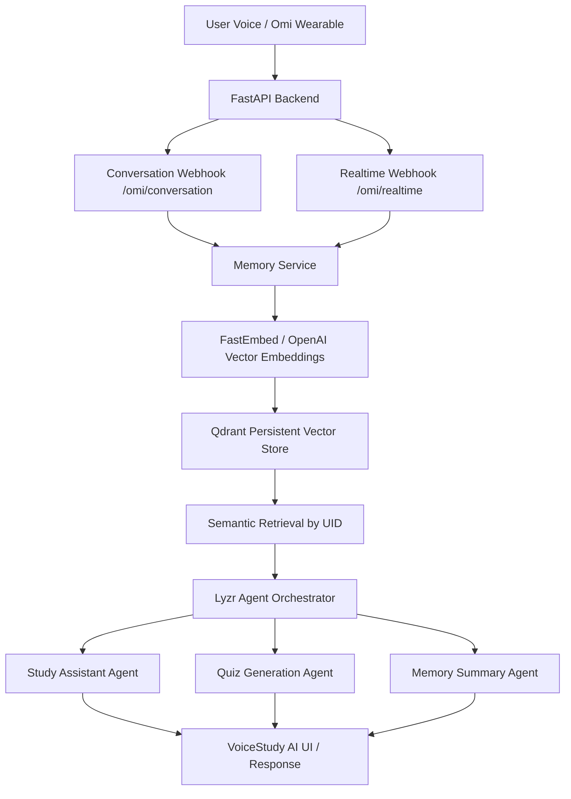

# VoiceStudy AI

> **Tagline:** Speak. Remember. Revise.  
> **Build Track:** Meeting & Lecture Intelligence  
> **Repository Description:** Voice-first AI study assistant with persistent Qdrant vector memory and Lyzr agent reasoning powered by Omi voice input.

---

## 1. Overview
**VoiceStudy AI** is a voice-first study and lecture intelligence assistant built for students and lifelong learners. Speak naturally about what you studied during lectures or study sessions, and VoiceStudy AI captures your spoken audio via **Omi Wearable**, stores vector embeddings in **Qdrant Vector Database**, and uses **Lyzr Agent Framework** for semantic retrieval, contextual explanations, and active recall revision quizzes.

---

## 2. Problem
Students attend hours of lectures and study sessions but struggle with active recall, contextual search across scattered notes, and quick exam revision. Taking notes manually takes focus away from active listening, while traditional note-taking apps lack intelligent semantic search grounded in personal learning history.

---

## 3. Solution
VoiceStudy AI creates a hands-free, intelligent learning loop:
1. **Hands-free Voice Ingestion**: Spoken study notes captured via Omi hardware or Web Speech API.
2. **Defensive Processing**: FastAPI backend extracts transcripts, speaker metadata, and structured overviews.
3. **Persistent Vector Memory**: Stores 1536-dimensional embeddings in Qdrant collections indexed by user `uid`.
4. **Agentic Active Recall**: Lyzr specialized agents search Qdrant memory to answer study questions and synthesize 5-question revision quizzes.

---

## 4. Key Features
- **🎙 Native Omi Wearable Integration**: Real-time & completed conversation webhook endpoints (`/omi/conversation`, `/omi/realtime`).
- **🗄 Qdrant Vector Memory**: Persistent vector storage with FastEmbed/OpenAI embeddings and strict `uid` multi-tenant isolation.
- **🤖 Lyzr Multi-Agent Reasoning**: Specialized Orchestrator, Assistant, Memory, and Quiz Agents.
- **⚡ Fast Webhook Responses**: Non-blocking background worker tasks ensure HTTP 200 responses in **< 50ms**.
- **🗑 Real Forget Memory Control**: Real point removal directly from Qdrant vector storage.
- **🔍 Live Observable Workflow**: Real-time dev execution progress panel (`[OMI]` $\rightarrow$ `[MEMORY]` $\rightarrow$ `[QDRANT]` $\rightarrow$ `[LYZR]` $\rightarrow$ `[APP]`).
- **📱 Responsive Glassmorphic UI**: Animated Voice Orb interface designed for desktop, tablet, and mobile browsers.

---

## 5. Why This Matters
By removing the manual friction of note organization and flashcard creation, VoiceStudy AI transforms passive lecture listening into permanent, searchable knowledge. Students retain material faster and perform better using grounded active recall.

---

## 6. Build Track
- **Track**: **Meeting & Lecture Intelligence**
- **Rationale**: VoiceStudy AI captures spoken lecture and study room audio, converts transcript streams into persistent semantic memory, and uses multi-agent reasoning to deliver contextual Q&A and lecture revision tools.

---

## 7. Architecture


**Official Connected Hackathon Flow:**
$$\text{Omi Voice} \longrightarrow \text{FastAPI Webhook} \longrightarrow \text{Memory Service} \longrightarrow \text{Qdrant Vector DB} \longrightarrow \text{Semantic Retrieval} \longrightarrow \text{Lyzr Agents} \longrightarrow \text{VoiceStudy AI Response}$$

---

## 8. Technology Stack
- **Frontend**: React, Vite, JavaScript, CSS (Custom Glassmorphic Theme), Lucide Icons, Web Speech API.
- **Backend**: Python 3.14+, FastAPI, Uvicorn, Pydantic, HTTPX, Python-dotenv.
- **AI Agent Framework**: Lyzr Agent Framework (`lyzr-agent-api`).
- **Vector Database**: Qdrant Vector Database (`qdrant-client`).
- **Hardware Integration**: Omi Wearable Voice API / Webhooks.

---

## 9. Omi Integration
FastAPI handles completed conversations and real-time streams with defensive parsing for all payload versions:
- `POST /omi/conversation?uid=YOUR_UID`
- `POST /omi/realtime?uid=YOUR_UID`
- `GET /omi/logs` (sanitized webhook inspector)

---

## 10. Qdrant Integration
Stores 1536-dimensional embeddings generated from study notes. Every record contains payload metadata (`id`, `text`, `subject`, `topic`, `uid`, `created_at`). Queries strictly enforce `uid_filter` for user privacy.

---

## 11. Lyzr Integration
The Lyzr multi-agent architecture coordinates:
- **Orchestrator Agent**: Intent classification (`REMEMBER`, `RETRIEVE`, `EXPLAIN`, `QUIZ`, `SUMMARIZE`).
- **Study Memory Agent**: Manages Qdrant vector persistence and study timeline summaries.
- **Study Assistant Agent**: Synthesizes structured study answers grounded in Qdrant context.
- **Quiz Agent**: Synthesizes 5 revision multiple-choice questions with answer keys.

---

## 12. End-to-End Workflow
1. Student speaks to Omi hardware.
2. Omi posts JSON payload to FastAPI webhook (`POST /omi/conversation`).
3. FastAPI parses text/overview defensively and queues background embedding.
4. Vector embedding saved into Qdrant collection tagged with `uid`.
5. Student asks a question via UI or voice.
6. Qdrant executes semantic similarity search filtered by `uid`.
7. Retrieved memories passed to Lyzr Agent.
8. Lyzr synthesizes final response rendered in VoiceStudy AI UI.

---

## 13. Project Structure
```
VOICESTUDY AI/
├── backend/
│   ├── main.py                  # FastAPI app entry point
│   ├── routes/                  # API routers (omi, study, memory, quiz, health)
│   ├── memory/                  # Qdrant vector memory service
│   ├── services/                # Omi parser, voice adapter, Lyzr framework
│   ├── agents/                  # Orchestrator, Assistant, Memory, Quiz agents
│   └── requirements.txt         # Python dependencies
├── frontend/
│   ├── index.html               # Web HTML entry
│   ├── vite.config.js           # Vite configuration
│   ├── package.json             # NPM dependencies
│   └── src/                     # React components, services, styling
├── tests/                       # Automated 14-step integration test suite
├── .env.example                 # Environment variable templates
├── .gitignore                   # Git exclusion configuration
├── DEMO_SCRIPT.md               # 5-minute official hackathon video demo guide
└── README.md                    # Project documentation
```

---

## 14. Environment Variables
Copy `.env.example` to `.env` in the project root:
```env
HOST=0.0.0.0
PORT=8000
ENV=development

# Real Lyzr Agent API Credentials (from https://agent.lyzr.ai)
LYZR_API_KEY=lyzr-your_api_key_here
LYZR_BASE_URL=https://agent-prod.lyzr.ai

# (Optional) Specific Lyzr Agent IDs configured per role
LYZR_AGENT_ID_ORCHESTRATOR=agent_orchestrator_id_here
LYZR_AGENT_ID_ASSISTANT=agent_assistant_id_here
LYZR_AGENT_ID_QUIZ=agent_quiz_id_here
LYZR_AGENT_ID_MEMORY=agent_memory_id_here

# OpenAI API Key (Required for text-embedding-3-small & real GPT model generation)
OPENAI_API_KEY=sk-proj-your_openai_api_key_here
LLM_MODEL=gpt-4o-mini

# Qdrant Memory Configuration (Persistent Local Disk Storage by Default)
QDRANT_STORAGE_PATH=./qdrant_data
# QDRANT_URL=http://localhost:6333
# QDRANT_API_KEY=your_qdrant_cloud_api_key

# Omi Webhook Secret & Keys
OMI_API_KEY=your_omi_api_key_here
OMI_WEBHOOK_SECRET=your_omi_webhook_secret_here
```

---

## 15. Local Setup
```bash
git clone https://github.com/your-username/voicestudy-ai.git
cd voicestudy-ai
```

---

## 16. Running the Frontend
```bash
cd frontend
npm install
npm run dev
```
> App opens at `http://localhost:5173`

---

## 17. Running the Backend
```bash
# Run from workspace root (using backend virtual environment)
.\backend\venv\Scripts\python.exe -m uvicorn backend.main:app --port 8000
```
> Server API runs at `http://localhost:8000`  
> Interactive OpenAPI Docs: `http://localhost:8000/docs`

---

## 18. Qdrant Setup
- **Persistent Local Disk Storage (Default)**: Set `QDRANT_STORAGE_PATH=./qdrant_data` (memories survive backend restarts automatically).
- **Docker Container**: Run `docker-compose up -d qdrant` and set `QDRANT_URL=http://localhost:6333`.
- **Qdrant Cloud**: Set `QDRANT_URL=https://<cluster-id>.qdrant.tech` and `QDRANT_API_KEY=<key>`.
- **In-Memory Mode (Testing)**: Set `QDRANT_URL=:memory:`.

---

## 19. Lyzr & OpenAI Setup
1. Add your Lyzr API Key (`LYZR_API_KEY=lyzr-...`) and optional role-specific Agent IDs in `.env`.
2. Add your OpenAI API Key (`OPENAI_API_KEY=sk-proj-...`) for `text-embedding-3-small` vector embeddings and LLM responses.
3. If unconfigured, VoiceStudy AI transparently uses an offline deterministic engine and SHA-256 hash vector fallback for local development without crashing.

---

## 20. Omi Setup & Manual Testing Procedures
1. **Automated Testing**: Run simulated webhooks via `.\backend\venv\Scripts\python.exe tests/test_omi_integration.py` or trigger `/omi/test` endpoint.
2. **Physical Omi Hardware Setup**:
   - Pair your Omi device in the Omi Mobile App.
   - Enable **Developer Mode** under Settings $\rightarrow$ Developer Settings.
   - Add custom Webhook URL (see Section 21).

---

## 21. ngrok / Cloudflared Webhook Setup
Expose your local FastAPI backend to the public internet for physical Omi hardware testing:
```bash
ngrok http 8000
```
In Omi app settings:
- **Conversation Webhook URL**: `https://<YOUR_NGROK_ID>.ngrok-free.app/omi/conversation?uid=user_1`
- **Realtime Webhook URL**: `https://<YOUR_NGROK_ID>.ngrok-free.app/omi/realtime?uid=user_1`

---

## 22. Testing
Run the automated end-to-end integration test suite:
```bash
.\backend\venv\Scripts\python.exe tests/test_omi_integration.py
```

---

## 23. Manual Action Items Required for Live Production Credentials
| Integration | Default Mode | Credentials Required to Enable Live API Mode |
| :--- | :--- | :--- |
| **Lyzr Agents** | Local Offline Engine | Add `LYZR_API_KEY` (and optional Agent IDs) to `.env` |
| **Semantic Embeddings** | SHA-256 Vector Engine (1536 dim) | Add `OPENAI_API_KEY` to `.env` |
| **Vector Database** | Persistent Disk (`./qdrant_data`) | Fully persistent locally. (Optional: Set `QDRANT_URL` for cloud/docker) |
| **Physical Omi Wearable** | Webhook Receiver & Test Trigger | Expose backend via HTTPS (`ngrok http 8000`) and set URL in Omi Mobile App |

---

## 24. Privacy / Memory Controls
- **UID Isolation**: Memories stored under one `uid` are isolated and never returned for another user.
- **Forget Memory**: Real point deletion from Qdrant vector storage (`DELETE /api/memory/{id}`).

---

## 25. Troubleshooting
- **Webhook 404 Error**: Ensure backend is running and ngrok URL includes `/omi/conversation`.
- **Empty Qdrant Results**: Verify that the query uses the same `uid` query parameter as the stored memory.
- **Qdrant Storage Lock Error**: Ensure only one uvicorn process is accessing `./qdrant_data` concurrently.

---

## 26. Deployment Instructions
### Option A: Docker Compose Deployment
```bash
docker-compose up -d --build
```
* Backend container runs at `http://localhost:8000`.
* Qdrant persistent server container runs at `http://localhost:6333`.

### Option B: Cloud Hosting (Render / Railway / Vercel)
1. **Backend API (Render / Railway)**:
   * Build Command: `pip install -r backend/requirements.txt`
   * Start Command: `python -m uvicorn backend.main:app --host 0.0.0.0 --port $PORT`
   * Set environment variables from `.env.example`.
2. **Frontend UI (Vercel / Netlify / Cloudflare Pages)**:
   * Root Directory: `frontend`
   * Build Command: `npm run build`
   * Output Directory: `dist`
   * Environment Variable: `VITE_API_URL=https://<your-backend-api-url>`

---

## 27. Hackathon Requirements Checklist
- [x] Solo Participant
- [x] Omi genuinely integrated (Defensive webhook parser & background ingestion)
- [x] Qdrant genuinely integrated (Persistent local disk store & vector search)
- [x] Lyzr genuinely integrated (Configured framework with API client & fallback)
- [x] One connected execution loop
- [x] Public GitHub ready
- [x] Setup instructions
- [x] Architecture diagram
- [x] Working demo ready (`DEMO_SCRIPT.md`)
- [x] Zero API keys committed

---

## 28. Future Improvements
- Spaced repetition algorithm (SuperMemo SM-2) notification reminders.
- Multi-language voice note transcription support.
- Direct PDF and lecture slide ingestion into Qdrant memory.


